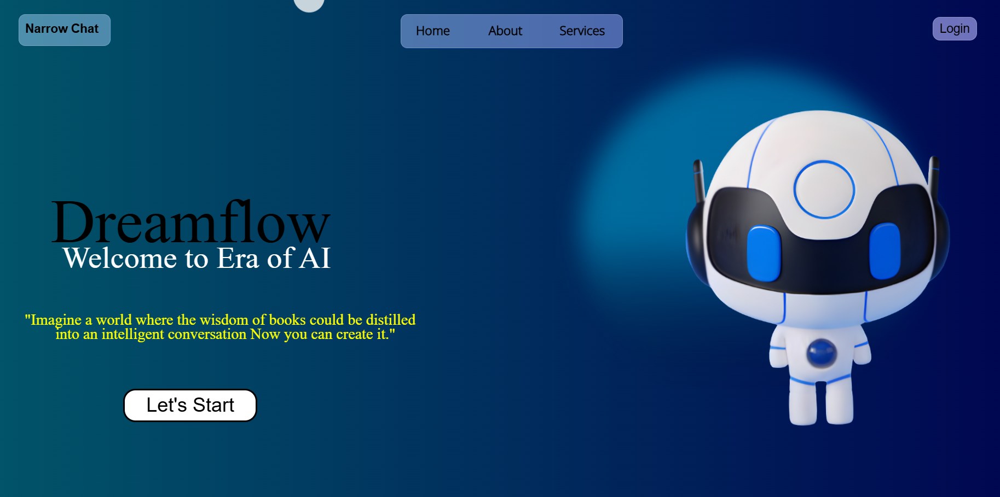
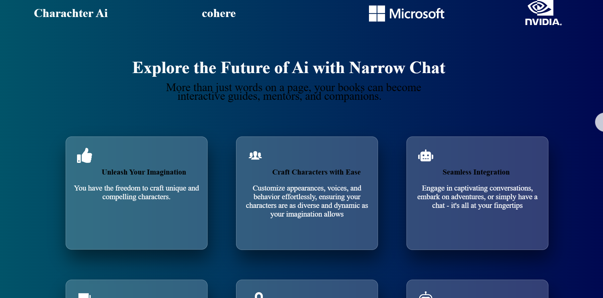
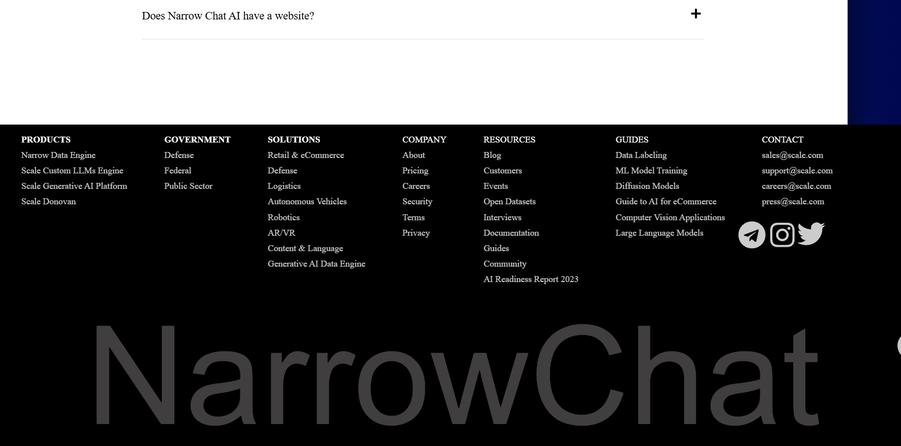

# Narrowchatdashboard


# NarrowChat AI - Responsive Animated Landing Page

## Overview

This project features a modern, responsive, and animated landing page designed for NarrowChat AI, an advanced AI-driven communication tool. The landing page is crafted to effectively showcase the product's features, engage visitors with captivating animations, and provide a seamless user experience across various devices.

## Features

- **Responsive Design:** The landing page is optimized for various screen sizes, including mobile, tablet, and desktop devices.
- **Animations:** Implemented smooth and engaging animations to enhance user interaction and highlight key elements of the product.
- **Interactive Elements:** Includes call-to-action buttons, interactive sections, and dynamic content to keep users engaged.
- **High-Quality Visuals:** Utilizes high-resolution images and graphics to represent NarrowChat AI effectively.
- **Performance Optimization:** Ensures fast loading times and smooth performance through efficient coding practices and optimization techniques.

## Technologies Used

- **HTML5:** For structuring the content.
- **CSS3:** For styling and animations.
- **JavaScript:** For interactive and dynamic features.
- **Responsive Frameworks:** (e.g., Bootstrap, Foundation) (if used)
- **Animation Libraries:** (e.g., Animate.css, GSAP) (if used)

## Installation

To view and run the landing page locally, follow these steps:

1. Clone the repository:
   ```bash
   git clone https://github.com/harshvardhan119/Narrowchatdashboard.git
   ```

2. Navigate to the project directory:
   ```bash
   cd narrowchat-ai-landing-page
   ```

3. Open the `index.html` file in your preferred web browser.

## Usage

1. **Customization:** Modify the content, styles, and animations as needed to align with the branding and features of NarrowChat AI.
2. **Deployment:** Deploy the landing page to a web hosting service or a static site generator platform to make it accessible online.

## Contributing

Contributions are welcome! Please fork the repository and submit a pull request with your changes. Ensure that your contributions align with the project's goals and adhere to the coding standards.


## Contact

For any questions or feedback, please contact:

- **Your Name:** harshvardhansinghha@gmail.com
- **GitHub:** https://github.com/harshvardhan119/Narrowchatdashboard.git


